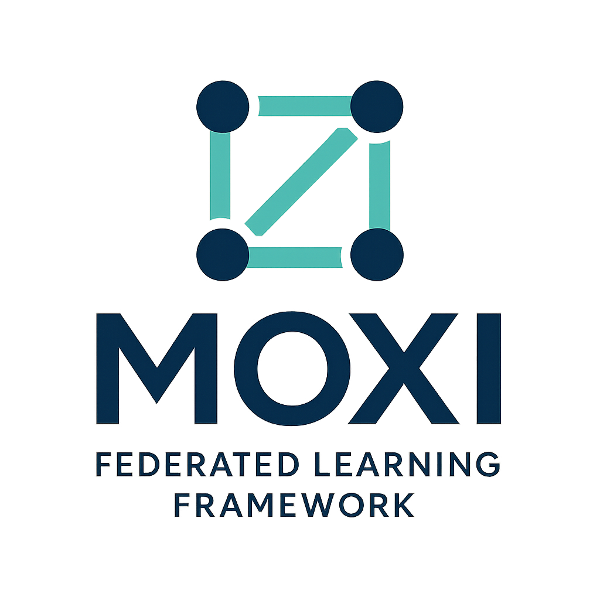

# MoxiFL

# MoxiFL

A flexible federated learning framework supporting both centralized and decentralized experimentation.

## Background

MoxiFL provides a comprehensive framework for federated learning experimentation that supports both centralized and decentralized approaches. Built upon the GVTMin methodology, MoxiFL abstracts the complexity of creating federated learning networks and implementing various federated learning strategies across distributed nodes.

The framework is designed to simplify the setup and execution of federated learning experiments while providing the flexibility to explore different network topologies and learning algorithms.

## Features

### Core Components
- **Policy Interface**: Flexible policy management for different federated learning strategies
- **Network Management**: Support for both centralized and decentralized network topologies
- **Node Abstraction**: Simplified device/participant management across the federated network
- **Trainer Integration**: Built-in training coordination with comprehensive logging

### Monitoring & Visualization
- **MLflow Integration**: Automatic logging of training metrics and device performance
- **Graphical Interface**: Visual tools for network simulation and monitoring
- **Real-time Tracking**: Monitor training progress across all participating nodes

### Network Support
- **Centralized FL**: Traditional server-client federated learning setup
- **Decentralized FL**: Peer-to-peer federated learning without central coordination
- **Hybrid Approaches**: Flexible configuration for mixed network topologies

## Current Limitations

### Framework Support
- **Machine Learning Libraries**: Currently supports PyTorch and scikit-learn only
- **Algorithm Coverage**: Limited to one centralized and one decentralized algorithm implementation

### Known Issues
- Limited documentation for advanced configuration
- Basic error handling in network communication
- Performance optimization needed for large-scale deployments

## Coming Soon

### Expanded Framework Support
- TensorFlow integration
- JAX/Flax compatibility
- Additional scikit-learn algorithm variants

### Algorithm Expansion
- Multiple centralized FL algorithms (FedAvg variants, FedProx, etc.)
- Additional decentralized algorithms (DGD, SCAFFOLD, etc.)
- Custom algorithm plugin system

### Enhanced Features
- Advanced privacy-preserving techniques
- Improved fault tolerance and recovery
- Enhanced visualization and analytics dashboard
- Docker containerization for easy deployment

## Architecture

MoxiFL is built around four core building blocks:

1. **Policy**: Defines the federated learning strategy and coordination rules
2. **Network**: Manages the topology and communication between nodes
3. **Node**: Represents individual participants in the federated learning process
4. **Trainer**: Handles local training and coordinates with the federated network

## Contributing

We welcome contributions! Please see [CONTRIBUTING.md](CONTRIBUTING.md) for guidelines on how to contribute to MoxiFL.

## License

[Add your license information here]

## Citation

If you use MoxiFL in your research, please cite:

```bibtex
@software{moxifl2024,
  title={MoxiFL: A Flexible Federated Learning Framework},
  author={[Your Name]},
  year={2024},
  url={https://github.com/SabGibson/MoxiFL}
}
```